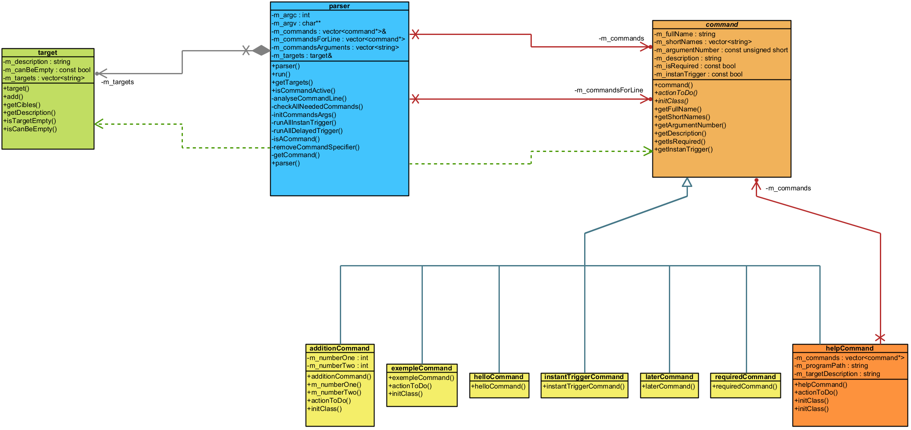

By HERVOUET Léo

# === PROJECT ===

The project was made with CLION and the WSL (Windows Subsystem for Linux).

The aim of this project is to make a command-line parsing library to analyze and manage commands passed through the command  
line in a generic and adaptable way.  
The library should handle commands with various arguments and targets.

# === RUN ===

You need to be under Linux to use the Makefile, compile and run the project.

## Makefile
You need to be at the root of the project to be able to use the Makefile.  

- `make lib` : use this command to compile the library which is **libparser.a**.
- `make program` or `make` : use one of these command to make the executable **program**.  
  (these commands will also make the lib to be able to make the executable)
- `make clean` : use this command to clean the project directory.

The executable is in release mode and make with c++17.

# === STRUCTURE ===

## UML 

UML diagram of the project with the lib and the classes that are in the test program.  
**In the lib :** target, parser, command and helpCommand.  
**In the test program :** additionCommand, helloCommand, instantTriggerCommand, laterCommand, requiredCommand.  
 


## LIB

It's where the command-line parsing library is.  
If you just need the library then just take this directory.  

- **/lib**
  - **/commands**
    - **/command** : generic command that you need to derive to implement yours.
      - _command.cpp_
      - _command.h_
    - **/helpCommand** : derived from command to implement the -help command. Have a special treatment in the parser.  
      - _helpCommand.cpp_
      - _helpCommand.h_
  - **/parser** : retrieve the command line to process it by calling the right commands.  
    - _parser.cpp_
    - _parser.h_
  - **/target** : used to store all the targets the user will provide.
    - _target.cpp_
    - _target.h_

## SRC

It's where the test program that use the library is.  
We have multiple commands to show that the parser is working.

- **/src**
  - **/commands**
    - **/additionCommand** : command to add two integer and print the result.
      - _additionCommand.h_
    - **/helloCommand** : command to print 'Hello World !'.
      - _helloCommand.h_
    - **/instantTriggerCommand** : command to show the system of priority between commands, this one need to be done before others.
      - _instantTriggerCommand.h_
    - **/laterCommand** : command to also show the system of priority, but here this one can be done 
    after more important one (like instantTriggerCommand).  
      - _laterCommand.h_
    - **/requiredCommand** : command to show that a command can be required.
      - _requiredCommand.h_
  - _main.cpp_ : main file to use the parser.


# === TESTS ===

**Basic command line :** `./program -h -required file`  
- -h : to print the help of all commands.  
- -required : because in this program, this is a required command.  
- file : because in this program we need to have one or more than one target file.  

**Output :** 
```

Usage: program [options] file...
Options:
  -help,-h :                        Display this information.
  -hello,-hel :                     Display 'Hello World !'.
  -instantTrigger,-it,-trigger :    Display 'Instant Trigger' before the other commands.
  -later :                          Display 'Later', at the end of important commands.
  -required,-r,-req :               Display 'Required', this command is required.
  -Addition,-a,-add :               Display the sum of two 'int'. Exemple: -a 1 2.
Files:
  Target description.

>>> Required action.

Test Program - HERVOUET Léo

Display of all the targets:
file
```

## Immediate application of a command.

**Command line :** `./program -required -later -hello -instantTrigger file`  

In this case, we expect the 'instantTrigger' command to be executed first and after the others.

**Output :**
```
>>> Instant Trigger action.
>>> Required action.
>>> Later action.
>>> Hello World !

Test Program - HERVOUET Léo

Display of all the targets:
file
Special treament for the command 'later'.
```

We can see that the 'instantTrigger' is done before the others even it's the last command on the command line.  
And because the others are normal commands, they are done in the order of the command line.

## Application of a command at the end of processing.

**Command line :** `./program -required -hello -later file`

In this case, because 'later' is the last command and the other command are normal ones, we expect it to be the last executed.

**Output :**
```
>>> Required action.
>>> Hello World !
>>> Later action.

Test Program - HERVOUET Léo

Display of all the targets:
file
Special treament for the command 'later'.
```

We can see that it's the case, 'later' is executed in last as expected.

## Detection of the absence of a command that is needed.

**Command line :** `./program file`

In this case we expect to have an error because the 'required' command is not in the command line.

**Output :**
```
Error : -required command is missing.
```

As expected we have an error in return.

## Management of a nonexistent command.

**Command line :** `./program -required -wrongCommand file`

In this case we expect to have an error because 'wrongCommand' does not exist.

**Output :**
```
Error : the command -wrongCommand does not exist.
```

As expected we have an error in return.

## Detection of command parameters.

**Command line :** `./program -required -add 1 2 file`

Here we expect the parser to detect that the 'add' command need two arguments and we expect that '1 2' are not recognized has targets files.

**Output :**
```
>>> Required action.
>>> Addtion of 1 + 2 = 3

Test Program - HERVOUET Léo

Display of all the targets:
file
```
 
As expected the '1 2' are not recognized has targets files and the 'add' command well received its two arguments. 

## Verify the preservation of the order in the command processing.

**Command line :** `./program -hello -later -required file`

We expect the 'hello' command to be executed first, then the 'later' command and finally the 'required' command.

**Output :**
```
>>> Hello World !
>>> Later action.
>>> Required action.

Test Program - HERVOUET Léo

Display of all the targets:
file
Special treament for the command 'later'.
```

As expected, the 'hello' command is execute first, then the 'later' command and finally the 'required' command.

## MORE

**Command line :** `./program -required file1 file2 file3 file4 file5`  
All the targets files are found.  

**Command line :** `./program -required -hello -hello file`  
The 'hello' command is executed two time because it's on the dev user to decide if a command can be use one time or more.  

If the dev user use the same name or short name for two commands, then it will be the first one give to the parser command list 
that will be trigger first.

If the dev user want to know the targets files, he can call a method from the parser that will give him the list.  

If the dev user want to know if a specific command (with its full name) is in the command line, then he can call a method 
from the parser that will tell him if it's the case or not.

# === COMMAND IMPLEMENTATION ===

Basic implementation for a command :

```c++
class exempleCommand : public command
{
public:
    exempleCommand() : command(/*Full name of the command*/, /*Number of arguments*/, /*Description of the command*/,
                             /*true if the command is required else false*/, 
                             /*true if the command need to be done in priority else false*/, 
                             /*List of the short name for this command*/) {}

    void actionToDo()
    {
        // Do your special treatment here.
    }

    int initClass([[maybe_unused]] const std::vector<std::string>& arg)
    {
        // Affect your arguments to your class if you have asked to have some.
        return 0;
    }
};
```